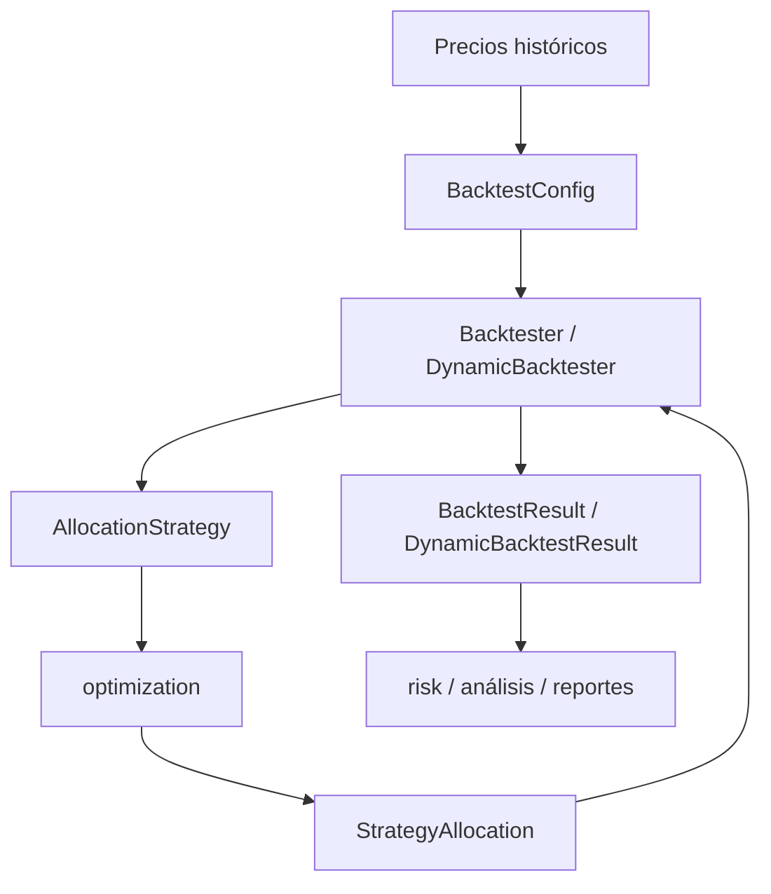
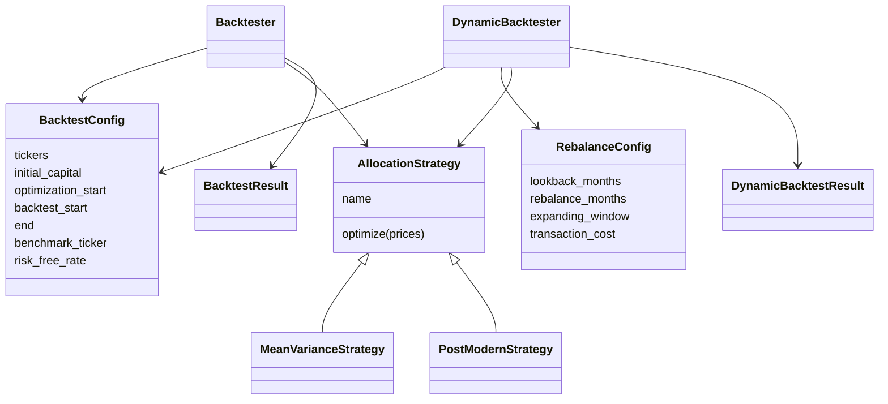
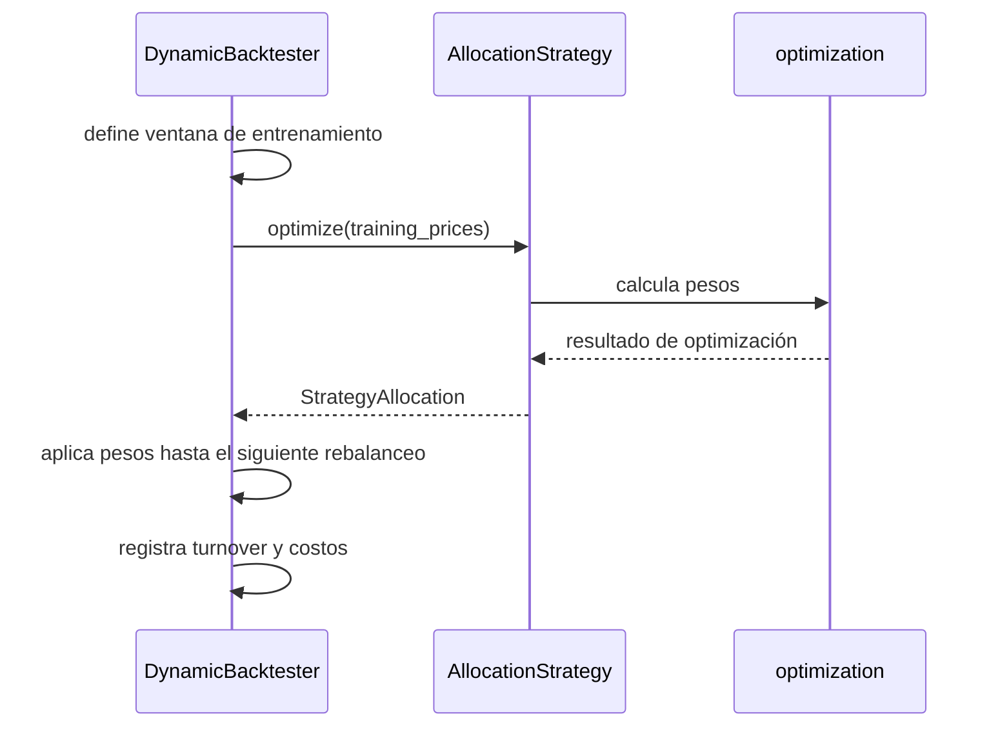

# Arquitectura Del Módulo `backtesting`

`src.backtesting` traduce ideas de portafolio en una simulación histórica. Está
diseñado para mantenerse cerca del contenido del curso, pero con una estructura
más robusta: configuración declarativa, estrategias intercambiables, resultados
tipados y separación entre backtest estático y dinámico.

## Capas



## Relación Entre Módulos



## Backtesting Estático

El motor estático sigue la metodología de `16.Backtesting.ipynb`.

```text
optimization_start ───── backtest_start ───────────────── end
      │                         │                           │
      └──── ventana in-sample ──┘                           │
                                └──── ventana out-of-sample ┘
```

Flujo:

1. Se descargan o reciben precios.
2. Se separa una ventana de optimización.
3. La estrategia calcula pesos una sola vez.
4. Esos pesos se aplican a toda la ventana de backtest.
5. Se calculan evolución, retornos y métricas.

Esto es simple, útil y coherente para comparar objetivos como Min Var, Max
Sharpe, Min Semivar u Omega sin introducir rebalanceo.

## Backtesting Dinámico

El motor dinámico extiende la lógica de `21.- Backtesting Dinámico.ipynb`.

```text
optimization_start ───── backtest_start ───────────────────────── end
      │                         │                                  │
      └──── datos previos ──────┘                                  │
                                │                                  │
                                ├─ rebalance 1: optimiza pesos
                                ├─ rebalance 2: reoptimiza pesos
                                ├─ rebalance 3: reoptimiza pesos
                                └─ ...
```

En cada fecha de rebalanceo:



## Responsabilidades Por Archivo

### `engine_static.py`

Contiene `Backtester`, también expuesto como `StaticBacktestEngine`.

Responsabilidades:

- Validar precios.
- Separar ventanas in-sample y out-of-sample.
- Ejecutar una o varias estrategias.
- Simular evolución con pesos constantes.
- Calcular métricas de desempeño.

### `engine_dynamic.py`

Contiene `DynamicBacktester`, también expuesto como `DynamicBacktestEngine`.

Responsabilidades:

- Generar fechas de rebalanceo.
- Construir ventanas de entrenamiento rolling o expanding.
- Reutilizar estrategias existentes.
- Simular capital entre rebalanceos.
- Registrar pesos, turnover y costos de transacción.

### `strategies.py`

Define la interfaz común `AllocationStrategy` y adaptadores sobre optimización.

Responsabilidades:

- Traducir una ventana de precios en pesos.
- Encapsular objetivos de optimización.
- Mantener al motor de backtesting desacoplado de fórmulas específicas.

Clases:

- `AllocationStrategy`
- `MeanVarianceStrategy`
- `PostModernStrategy`

### `results.py`

Contiene configuraciones y modelos de resultado.

Responsabilidades:

- Validar parámetros de backtesting.
- Transportar asignaciones, retornos, evolución y métricas.
- Separar resultados estáticos y dinámicos.

Clases:

- `BacktestConfig`
- `RebalanceConfig`
- `StrategyAllocation`
- `BacktestStrategyResult`
- `BacktestResult`
- `DynamicBacktestStrategyResult`
- `DynamicBacktestResult`

### `_helpers.py`

Contiene utilidades compartidas:

- normalización de precios;
- normalización de benchmark;
- selección de ventanas temporales;
- construcción de objetos `Portfolio` desde precios en memoria.

## Ventanas Rolling Y Expanding

`DynamicBacktester` usa `RebalanceConfig` para decidir cómo mirar el pasado.

Con `expanding_window=False`, la ventana rueda:

```text
Rebalance 2022-01: usa 2021-01 a 2022-01
Rebalance 2022-02: usa 2021-02 a 2022-02
Rebalance 2022-03: usa 2021-03 a 2022-03
```

Con `expanding_window=True`, la ventana crece:

```text
Rebalance 2022-01: usa 2021-01 a 2022-01
Rebalance 2022-02: usa 2021-01 a 2022-02
Rebalance 2022-03: usa 2021-01 a 2022-03
```

La rolling window reacciona más a cambios recientes. La expanding window usa más
historia y suele ser más estable.

## Encaje Con El Curso

El motor estático corresponde directamente al notebook de backtesting estático:
optimización inicial, evaluación fuera de muestra y métricas de desempeño.

El motor dinámico corresponde al notebook de backtesting dinámico: rebalanceo,
reoptimización y simulación por bloques. La diferencia principal es que aquí la
optimización no está escrita dentro del motor. Se delega a estrategias, lo cual
mantiene el sistema más extensible.
