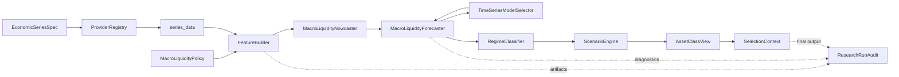
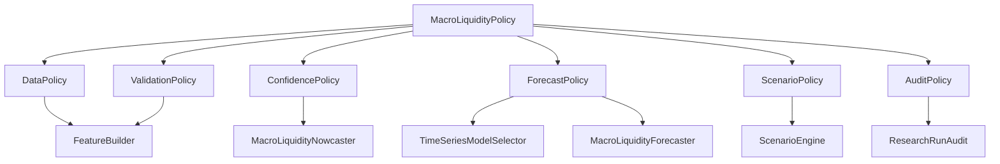
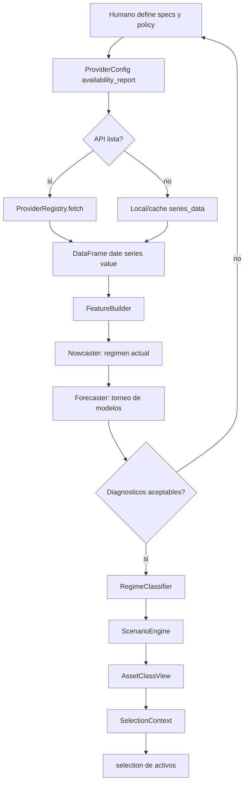

# MacroLiquidityPolicy Y Flujo Operativo

## Objetivo

Este documento explica que puedes modificar cuando escribes:

```python
policy = MacroLiquidityPolicy()
```

`MacroLiquidityPolicy` no descarga datos, no clasifica regimenes por si sola y no escoge activos. Es el objeto de gobierno metodologico que controla como se tratan los datos, como se validan las series, como se calcula confianza, como compiten los modelos de series de tiempo, como se asignan probabilidades de escenario y donde queda la auditoria.

## Que Puedes Definir Tu

| Subpolitica | Clase | Lo que puedes definir | Impacta en |
|---|---|---|---|
| Datos | `DataPolicy` | `data_mode`, `real_time_safe`, `canonical_frequency`, `rebalance_frequency`, `quarterly_interpolation`, publication lags | `FeatureBuilder` y comparabilidad temporal |
| Validacion | `ValidationPolicy` | historia minima, missing ratio maximo, estabilidad minima, penalizacion de candidatos | inclusion o degradacion de indicadores |
| Confianza | `ConfidencePolicy` | pesos de coverage, agreement, stability, freshness, narrative y umbral de contradiccion | confianza del nowcast y del forecast |
| Forecast | `ForecastPolicy` | horizontes, benchmark AR(1), modelos candidatos, RMSE/MAE, rolling CV, bootstrap, grilla SARIMA | seleccion de modelos y regimen esperado |
| Escenarios | `ScenarioPolicy` | probabilidad base, penalizacion downside, castigo por liquidez restrictiva | escenario base/upside/downside |
| Auditoria | `AuditPolicy` | carpeta de salida y escritura de artifacts | reproducibilidad del research |

## Que Ya Esta Definido En Codigo

| Pieza | Donde vive | Que hace | Lo modificas normalmente? |
|---|---|---|---|
| `EconomicSeriesSpec` | `catalog.py` | Contrato de cada serie economica | Si, al definir variables |
| `ProviderRegistry` | `providers.py` | Enruta specs a providers | Solo si agregas fuentes |
| `FeatureBuilder` | `features.py` | Alinea, transforma y valida datos | No en notebook |
| `MacroLiquidityNowcaster` | `nowcast.py` | Calcula scores actuales y confianza | No, salvo cambios metodologicos |
| `TimeSeriesModelSelector` | `model_selection.py` | Compara modelos con rolling CV | No, lo gobiernas con `ForecastPolicy` |
| `MacroLiquidityForecaster` | `forecasting.py` | Pronostica cada `*_score` | No, lo gobiernas con `ForecastPolicy` |
| `RegimeClassifier` | `classification.py` | Convierte forecasts a regimenes | No, salvo redisenar reglas |
| `ScenarioEngine` | `scenarios.py` | Genera escenarios probabilisticos | Parcial: por `ScenarioPolicy` u overrides |
| `build_asset_class_view` | `asset_view.py` | Traduce regimen a postura de activos | No en notebook |
| `MacroLiquidityWorkflow` | `pipeline.py` | Orquesta todo el flujo | No, lo llamas |

## Mapa De Clases Del Modulo

| Modulo | Clases/objetos principales | Rol dentro del flujo | Configuracion normal |
|---|---|---|---|
| `policy.py` | `MacroLiquidityPolicy`, `DataPolicy`, `ValidationPolicy`, `ConfidencePolicy`, `ForecastPolicy`, `ScenarioPolicy`, `AuditPolicy` | Gobierno metodologico | Si, mediante `replace(...)` |
| `catalog.py` | `EconomicSeriesSpec` | Define cada indicador economico | Si, al construir `specs` |
| `providers.py` | `ApiConnectionSpec`, `ProviderCredentials`, `ProviderConfig`, `ProviderRegistry`, `FredApiProvider`, `BeaApiProvider`, `BlsApiProvider`, `TreasuryFiscalDataProvider`, `FedDdpProvider`, `LocalSeriesProvider` | Descarga o carga datos en contrato largo `date, series, value` | Credenciales por env; provider solo al extender fuentes |
| `features.py` | `FeatureBuilder`, `FeatureBuildResult` | Alinea frecuencia, aplica lags, transforma, valida y construye panel | Via `DataPolicy` y `ValidationPolicy` |
| `nowcast.py` | `MacroLiquidityNowcaster`, `NowcastResult` | Calcula regimen actual, confianza y contribuyentes | Via `ConfidencePolicy` |
| `model_selection.py` | `TimeSeriesModelSelector`, `TimeSeriesFit`, `TimeSeriesModelSelectionResult` | Torneo de modelos con rolling CV | Via `ForecastPolicy` |
| `forecasting.py` | `MacroLiquidityForecaster`, `ForecastResult` | Forecast por score y diagnosticos agregados | Via `ForecastPolicy` |
| `classification.py` | `RegimeClassifier`, `RegimeView` | Convierte forecast en regimen esperado y probabilidades | Definido en codigo |
| `scenarios.py` | `ScenarioEngine`, `ScenarioBuildResult`, `ScenarioOverride` | Escenarios base/upside/downside y overrides | Via `ScenarioPolicy` y overrides |
| `asset_view.py` | `AssetClassView`, `build_asset_class_view` | Traduce regimenes a postura por clases de activo | Pesos internos, salvo redisenar metodologia |
| `audit.py` | `ResearchRunAudit` | Persistencia de evidencias | Via `AuditPolicy` |
| `pipeline.py` | `MacroLiquidityWorkflow`, `MacroLiquidityWorkflowResult` | Orquestacion end-to-end | Se llama, no se modifica |
| `regimes.py` | `CurrentRegimeSnapshot`, `MacroLiquidityResearch`, `MacroLiquidityResult` | API historica/simple de regimen actual | Uso legacy o diagnostico rapido |

## Diagrama 1: Arquitectura Del Modulo



## Diagrama 2: Superficie Modificable



## Diagrama 3: Flujo Operativo Para Notebook



## Como Se Determina La Postura

1. `FeatureBuilder` transforma series heterogeneas a un panel comparable.
2. `MacroLiquidityNowcaster` calcula la foto actual: crecimiento, inflacion, empleo, liquidez y condiciones financieras.
3. `TimeSeriesModelSelector` prueba modelos por cada score y selecciona el mejor solo si vence al benchmark definido.
4. `MacroLiquidityForecaster` produce forecast central, lower y upper.
5. `RegimeClassifier` convierte esos forecasts en regimen esperado, downside y upside.
6. `ScenarioEngine` asigna probabilidades usando `ScenarioPolicy` y registra overrides.
7. `build_asset_class_view` traduce regimenes a postura por clases de activo.
8. `build_selection_context` cruza esa postura con el perfil del cliente.

## Donde Se Calcula La Probabilidad Del Regimen

La probabilidad no sale de una unica clase aislada. Se forma por capas:

1. `MacroLiquidityNowcaster` calcula confianza del estado actual con coverage, agreement, stability, freshness y narrative coherence.
2. `MacroLiquidityForecaster` reduce o sostiene la confianza segun errores de forecast y volatilidad residual.
3. `RegimeClassifier` produce `regime_view.probabilities`, con probabilidad macro y probabilidad de liquidez para el regimen esperado.
4. `ScenarioEngine` asigna probabilidades a `base`, `upside` y `downside` usando `ScenarioPolicy` y la confianza disponible.
5. Si hay juicio humano, `ScenarioOverride` deja evidencia de quien ajusto, que cambio y por que.

## Archivos De Diagrama

- [macro_liquidity_module_architecture.drawio](./diagrams/macro_liquidity_module_architecture.drawio)
- [macro_liquidity_class_architecture.drawio](./diagrams/macro_liquidity_class_architecture.drawio)
- [macro_liquidity_workflow.drawio](./diagrams/macro_liquidity_workflow.drawio)
- [open_in_diagrams_net.md](./diagrams/open_in_diagrams_net.md)

## Ejemplo Minimo De Configuracion

```python
from dataclasses import replace
from src.research.macro_liquidity import MacroLiquidityPolicy

policy = MacroLiquidityPolicy()
policy = replace(
    policy,
    forecast=replace(
        policy.forecast,
        benchmark_model="ar1",
        candidate_models=("mean_reversion", "ets", "auto_sarima", "bootstrap_ar1"),
        selection_metric="rmse",
        min_improvement_over_benchmark=0.02,
        rolling_forecast_horizon=3,
    ),
)
```
